# IEEE-754 Single-Precision Floating-Point Adder
### Low-Power Dual-Path Architecture vs. Baseline — RTL to Synthesis

> **Course Project** | VLSI Design | Vellore Institute of Technology, Vellore  
> **Authors:** Ashit Raj (23BVD0025), Avni Jain, Tanisha Gupta  
> **Tool:** Cadence Genus Synthesis Solution 21.14 | **Technology:** GPDK 45nm

---

## Overview

This project implements and compares two IEEE-754 single-precision (32-bit) floating-point adder architectures:

- **Baseline (`fp_adder_baseline`)** — A straightforward single-path adder using an iterative normalization loop, serving as the power and area reference.
- **Improved (`fp_dual_path_adder`)** — A dual-path architecture that separates *close* and *far* operand cases, enabling power gating on the inactive path and replacing the iterative loop with a parallel Leading Zero Detector (LZD).

Both designs are fully synthesized using Cadence Genus on a 45nm standard cell library (GPDK045), with complete area, power, and timing reports included.

---

## Repository Structure

```
ieee754-fp-adder/
├── src/
│   ├── fp_adder_baseline.v        # Baseline single-path adder
│   └── fp_dual_path_adder.v       # Improved dual-path adder
├── testbench/
│   ├── tb_fp_adder_baseline.v     # Testbench for baseline
│   └── tb_fp_adder_core.v         # Testbench for dual-path
├── synthesis/
│   ├── baseline/
│   │   ├── reports/
│   │   │   ├── report_area.rpt    # Cell count and area
│   │   │   ├── report_power.rpt   # Leakage, internal, switching power
│   │   │   └── report_timing.rpt  # Critical path and slack
│   │   └── scripts/
│   │       ├── run_synth.tcl      # Genus synthesis script
│   │       └── constraints.sdc    # Timing constraints
│   └── improved/
│       ├── reports/
│       │   ├── report_area.rpt
│       │   ├── report_power.rpt
│       │   └── report_timing.rpt
│       └── scripts/
│           ├── run_synth.tcl
│           └── constraints.sdc
└── docs/
    ├── schematic_baseline.png     # Genus GUI schematic — baseline
    └── schematic_improved.png     # Genus GUI schematic — improved
```

---

## Architecture

### IEEE-754 Single-Precision Format

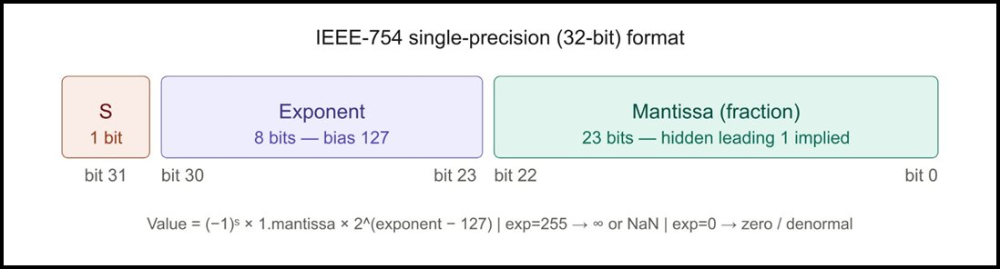

### Dual-Path Block Diagram

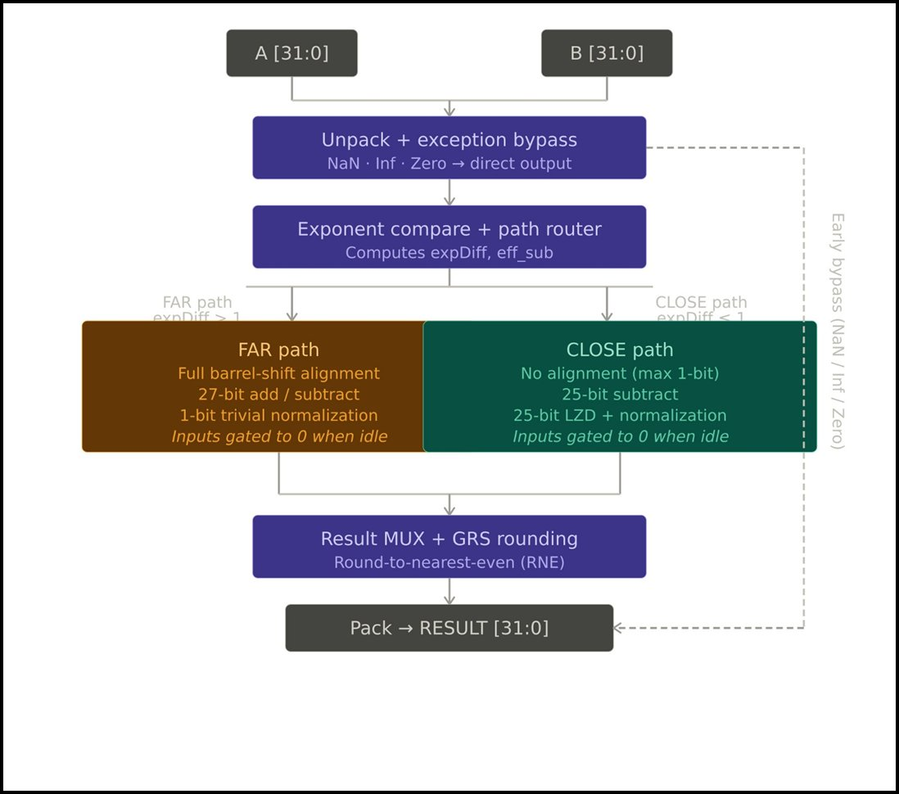

### Baseline — Single Path

The baseline processes every input pair through the same pipeline regardless of the operation type:

1. **Unpack** — Extract sign, exponent, and mantissa from both operands
2. **Magnitude Compare** — Determine the larger operand (always active)
3. **Alignment Shift** — Shift the smaller mantissa to match exponents (always active)
4. **Add/Subtract** — Perform mantissa operation
5. **Normalize** — Iterative `for` loop scanning up to 27 bits — the primary timing bottleneck
6. **Round** — Round-to-nearest-even
7. **Pack** — Reassemble the 32-bit result

The iterative normalization creates a long combinational chain that limits the achievable clock frequency.

### Improved — Dual Path with Power Gating

The improved design splits execution into two mutually exclusive paths based on the operand relationship:

- **Far Path** — Active when `|expA - expB| > 1` or for addition. After alignment, at most a 1-bit normalization shift is needed, so the expensive iterative loop is eliminated entirely.
- **Close Path** — Active only for subtraction with `|expA - expB| ≤ 1`. Catastrophic cancellation can occur here, requiring up to 24-bit normalization — handled by a fully parallel LZD (priority encoder), eliminating the sequential loop.

When one path is active, the other is **power-gated** (inputs forced to zero), cutting switching activity on the idle datapath. An early-bypass also short-circuits zero and infinity/NaN inputs before any computation.

```
         ┌─────────────┐
         │  Unpack &   │
         │Early Bypass │
         └──────┬──────┘
                │
         ┌──────▼──────┐
         │  Magnitude  │
         │  Compare    │
         └──────┬──────┘
         expDiff│
        ┌───────▼────────┐
        │  Path Decision │
        └───┬────────┬───┘
            │        │
     ┌──────▼──┐  ┌──▼──────┐
     │Far Path │  │Close    │
     │(|ΔE|>1) │  │Path     │
     │Trivial  │  │(|ΔE|≤1) │
     │Norm     │  │Par. LZD │
     └──────┬──┘  └──┬──────┘
            └────┬───┘
           ┌─────▼──────┐
           │ Recombine  │
           │  + Round   │
           └─────┬──────┘
                 │
            RESULT[31:0]
```

---

## Synthesis Results (GPDK 45nm, PVT_1P1V_0C)

### Area

| Metric | Baseline | Improved | Reduction |
|---|---|---|---|
| Total Cell Count | 1173 | 990 | **−15.6%** |
| Core Cell Area (µm²) | 1978.8 | 1682.3 | **−15.0%** |
| Wrapper Total Area (µm²) | 2569.8 | 2273.3 | **−11.5%** |

### Power (Total)

| Category | Baseline (W) | Improved (W) | Change |
|---|---|---|---|
| Logic (Internal + Switching) | 2.079 × 10⁻⁴ | 2.050 × 10⁻⁴ | −1.4% |
| Register | 1.143 × 10⁻⁴ | 1.165 × 10⁻⁴ | +1.9% |
| **Total** | **3.292 × 10⁻⁴** | **3.284 × 10⁻⁴** | **−0.2%** |

> Power reduction is modest at typical activity; the dual-path benefit is most pronounced at high toggle rates where the idle path's switching suppression becomes significant.

### Timing (5 ns clock period)

| Metric | Baseline | Improved |
|---|---|---|
| Critical Path Delay (ps) | 3218 | 3336 |
| Setup Slack (ps) | **1669** | **1550** |
| Timing Status | MET ✓ | MET ✓ |

> Both designs meet timing comfortably. The improved design's slightly longer critical path is due to the parallel LZD mux tree on the close path, but the slack remains well positive.

---

## Simulation Waveforms

### Baseline (SimVision)
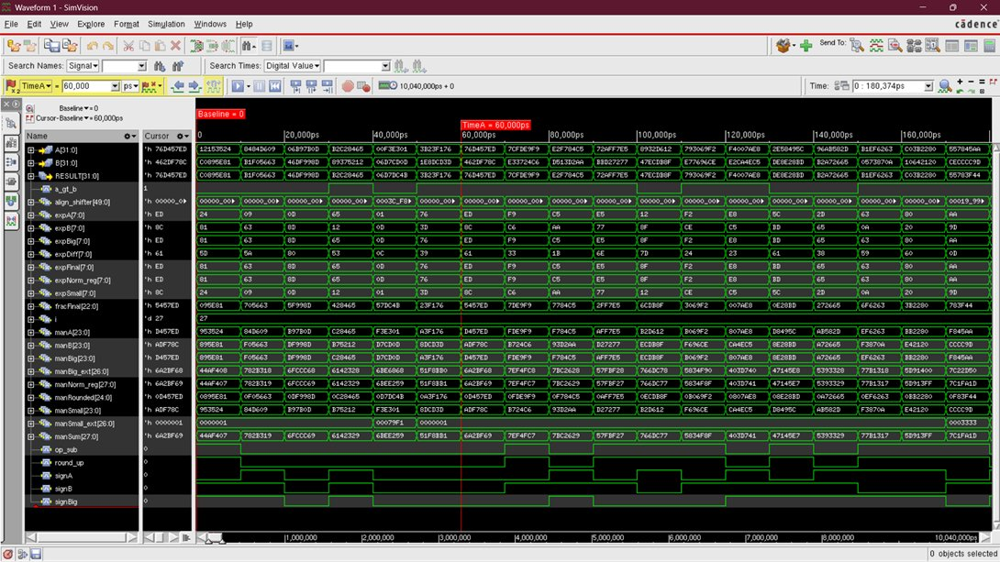

### Improved Dual-Path (SimVision)
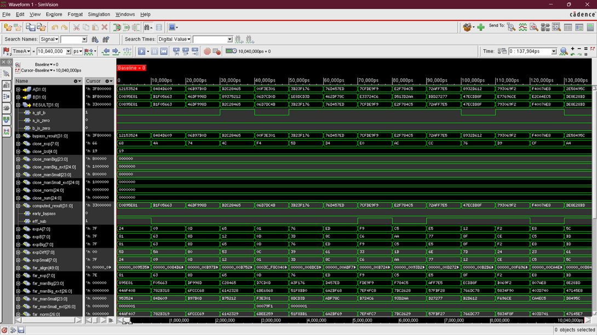
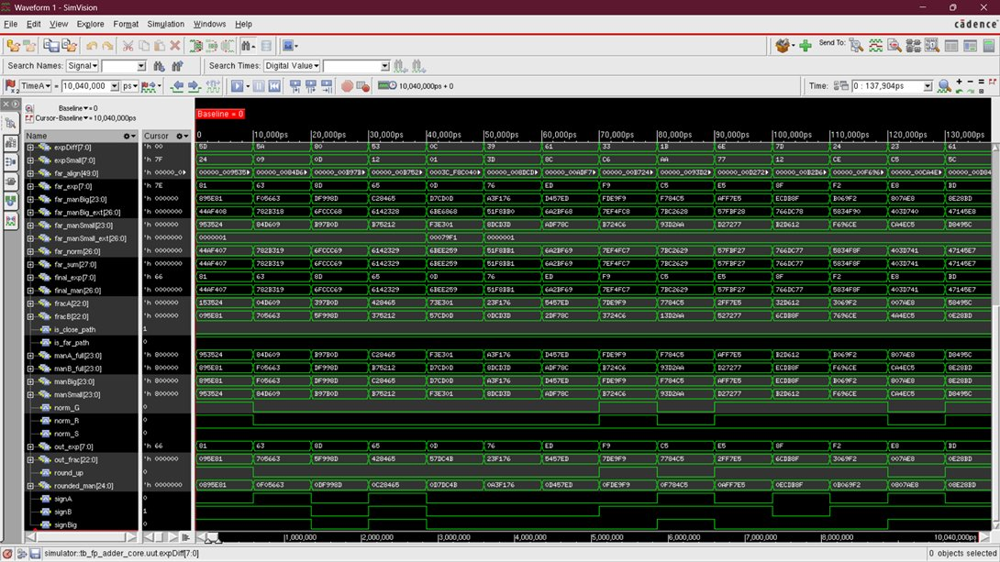

---

## Synthesis Schematics (Cadence Genus)

### Baseline — `fp_adder_wrapper`
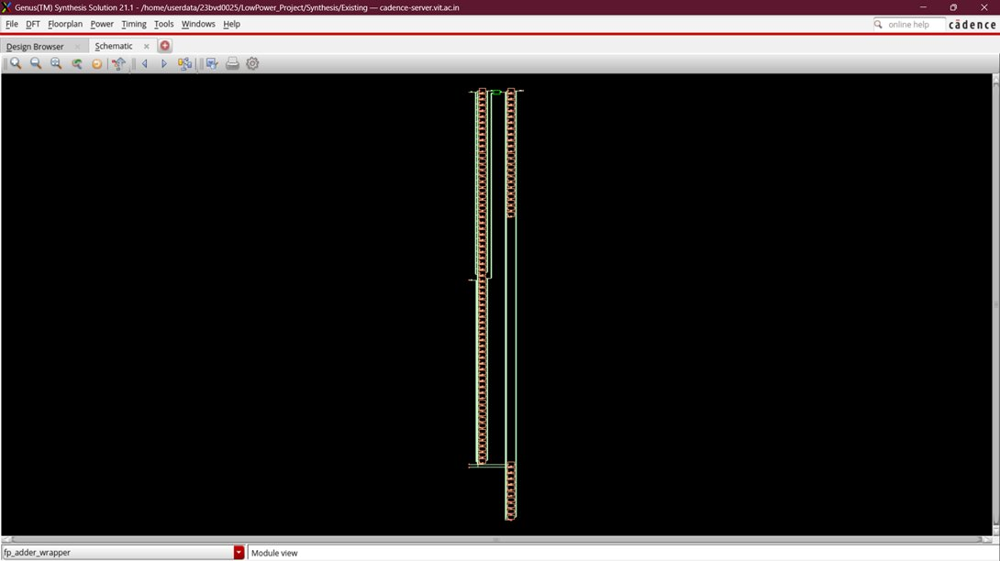
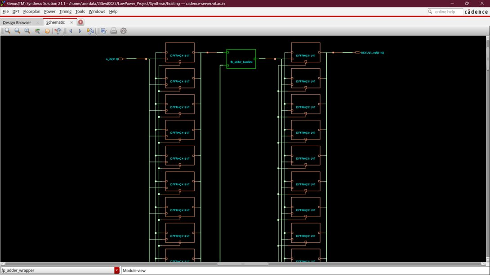

### Improved — `fp_dual_path_wrapper`
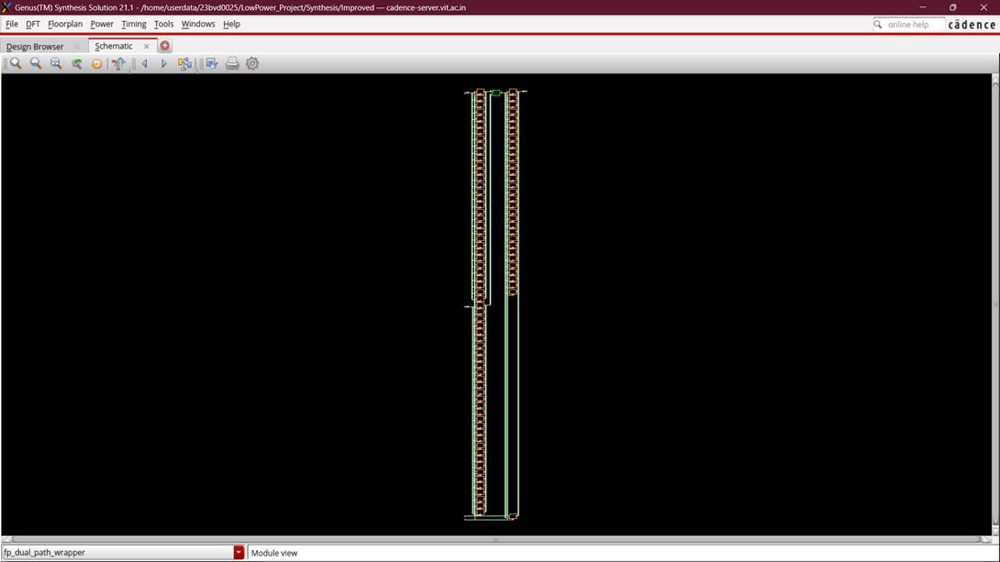
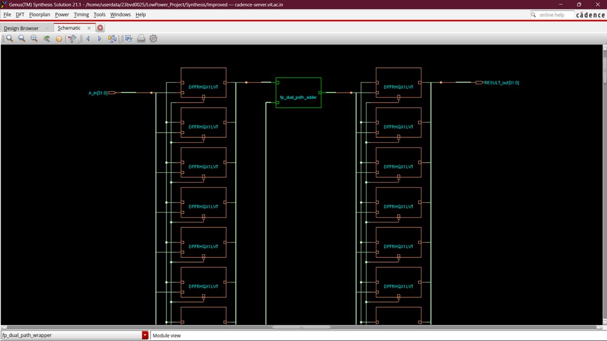

---

## Synthesis Report Screenshots

| Baseline Power | Baseline Area | Baseline Timing |
|---|---|---|
| 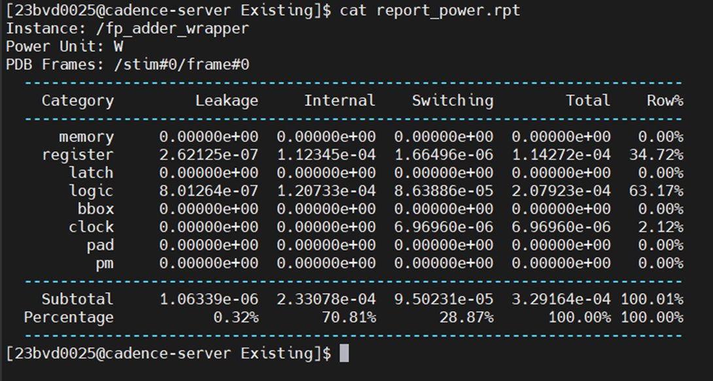 | 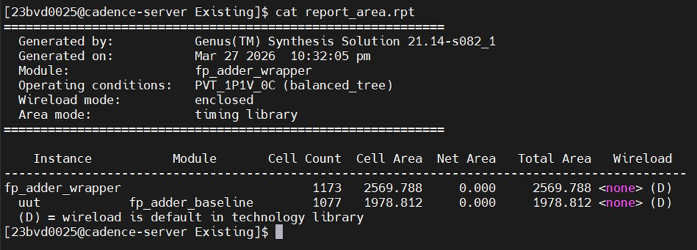 | 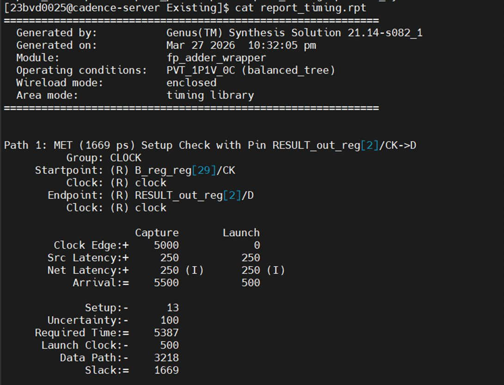 |

| Improved Power | Improved Area |
|---|---|
| 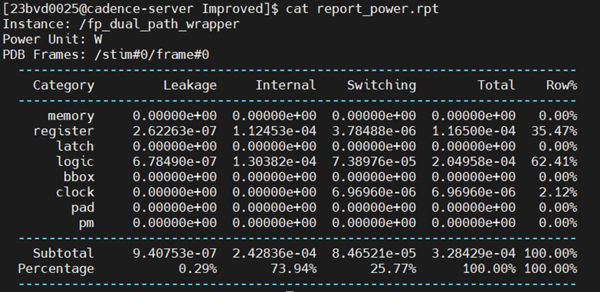 | 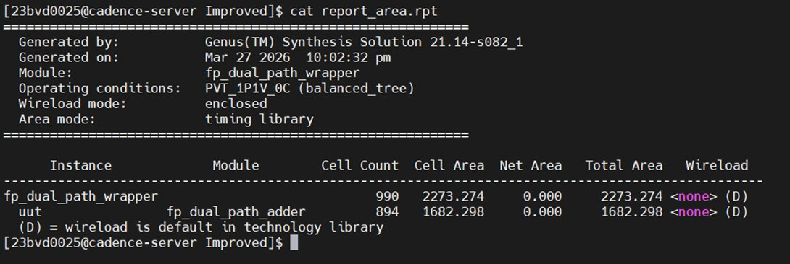 |

---

## How to Simulate (Cadence Xcelium)

```bash
# Baseline
xrun testbench/tb_fp_adder_baseline.v src/fp_adder_baseline.v -access +rwc -gui

# Improved
xrun testbench/tb_fp_adder_core.v src/fp_dual_path_adder.v -access +rwc -gui
```

## How to Synthesize (Cadence Genus)

```bash
# Baseline
cd synthesis/baseline/scripts
genus -f run_synth.tcl

# Improved
cd synthesis/improved/scripts
genus -f run_synth.tcl
```

---

## Key Design Decisions

| Decision | Rationale |
|---|---|
| Dual-path split at `\|ΔExp\| ≤ 1` | Close-path subtraction is the only case requiring deep normalization; separating it avoids penalizing the common far-path case |
| Parallel LZD (priority encoder) | Replaces iterative shift loop — O(1) depth vs O(N) depth, improving timing on the close path |
| Power gating via input zeroing | Forcing the inactive path's inputs to zero eliminates toggle activity without clock gating overhead in a combinational design |
| Early bypass for special values | Zero and infinity/NaN cases resolved before the main datapath, reducing unnecessary switching |

---

## IEEE-754 Compliance Notes

- Handles **normalized** and **denormalized** (subnormal) inputs
- **Round-to-nearest-even** (default IEEE-754 rounding mode)
- Special cases: zero inputs and infinity/NaN propagated via early bypass
- Does not implement: signaling NaN distinction, inexact/overflow exception flags

---

## Authors

| Name | Reg. No. |
|---|---|
| Ashit Raj | 23BVD0025 |
| Avni Jain | — |
| Tanisha Gupta | — |

School of Electronics Engineering, VIT Vellore
